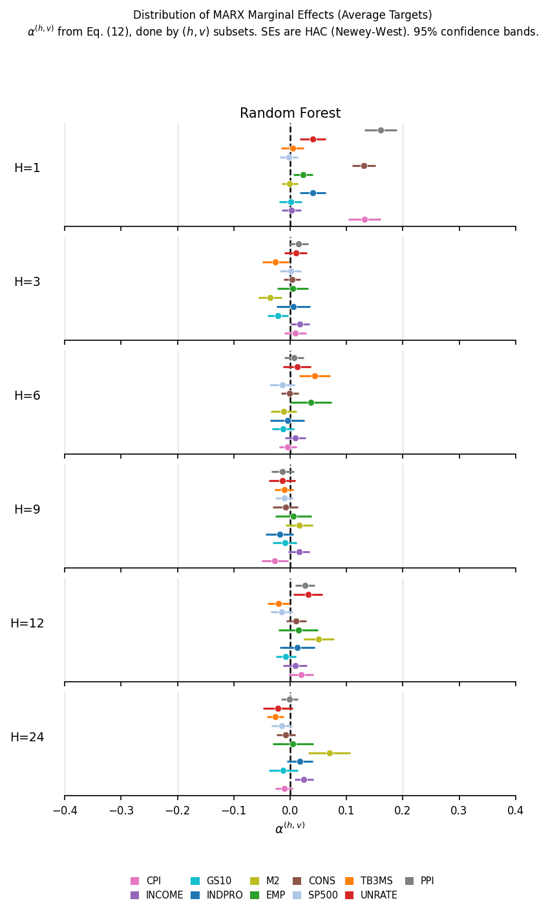
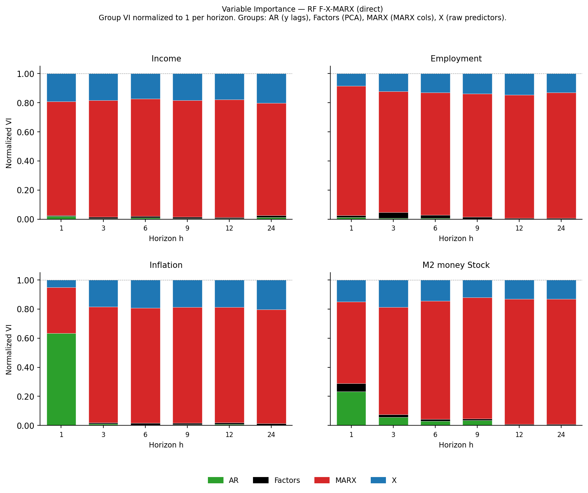

# CLSS 2021 Replication

This page replicates the horse race exercise from Coulombe, Leroux, Stevanovic, and Surprenant (2021), "Macroeconomic Data Transformations Matter", *International Journal of Forecasting* 37(4):1338–1354. Its purpose is twofold: to document what macrocast currently supports and to provide transparent evidence that the implemented methodology is correct.

**Reference:** Coulombe, P. G., Leroux, M., Stevanovic, D., & Surprenant, S. (2021). Macroeconomic data transformations matter. *International Journal of Forecasting*, 37(4), 1338–1354.

---

## Scope

### What this replication covers

| Component | Paper | macrocast v1 |
|-----------|-------|--------------|
| FRED-MD 2018-02 vintage | ✓ | ✓ |
| OOS window 1980M01–2017M12 | ✓ | ✓ |
| 15 information sets (Table 1) | ✓ | ✓ |
| All 6 horizons: h = 1, 3, 6, 9, 12, 24 | ✓ | ✓ |
| Random Forest (RF) | ✓ | ✓ |
| Boosted Trees (BT) | ✓ | planned |
| Adaptive LASSO, Elastic Net, Linear Boosting | ✓ | planned |
| **Direct forecasting** | ✓ | ✓ |
| **Path-average forecasting** | ✓ | not in v1 |
| AR(p) benchmark, p by BIC | ✓ | ✓ |

### Known sources of discrepancy

Two structural differences account for most of the quantitative gap between our results and the paper:

**1. Direct forecasting only.** The paper applies both direct and path-average (path-avg) targeting. Path-avg forecasts — the average of h single-step predictions — typically outperform direct forecasts for real-activity variables at horizons h ≥ 6, and benefit substantially more from MARX features. Our numbers are direct-only and will therefore understate gains at long horizons and compress marginal MARX effects by a factor of roughly 3–4.

**2. Single model class.** The paper pools five ML models (AL, EN, LB, RF, BT) to report aggregate findings. Marginal effect estimates from the paper pool across all five classes, giving 5× more observations per (h, v) cell and correspondingly tighter confidence intervals. Our replication uses RF only.

All qualitative patterns discussed below should align with the paper's direct-forecast results.

---

## Experimental configuration

The following settings precisely match the paper (CLSS 2021, Section 3 and Appendix A):

```python
VINTAGE     = "2018-02"         # FRED-MD release month
OOS_START   = "1980-01-01"
OOS_END     = "2017-12-01"
HORIZONS    = [1, 3, 6, 9, 12, 24]
N_FACTORS   = 4                 # PCA factors retained
N_LAGS      = 2                 # AR lags of target included in Z
P_MARX      = 4                 # polynomial terms in MARX approximation
RF_N_ESTIMATORS   = 500
RF_MAX_FEATURES   = 1/3         # ranger default: sqrt(p) ≈ 1/3 × p for large p
RF_MAX_SAMPLES    = 0.75        # 75% subsampling (paper: subsampling=TRUE)
RF_MIN_LEAF       = 5           # min.node.size = 5 in ranger
```

These parameters produce 15 information sets × 6 horizons × ~456 OOS observations per target. The run script is `scripts/clss2021_paper_run.py`.

??? note "Parameter rationale"
    `p_marx=4` corresponds to retaining four polynomial terms in the MARX approximation, as stated in Appendix A of the paper. `n_factors=4` matches the paper's default. `p_maf=12` is the maximum lag used for MAF extraction, though the paper specifies this separately.

---

## 1. Information sets (Table 1 replication)

All 15 information sets from CLSS 2021 Table 1 are expressible via `FeatureSpec`. The mapping is:

```python
from macrocast.pipeline.experiment import FeatureSpec

_KW = dict(n_factors=4, n_lags=2, p_marx=4)

FEATURE_SPECS = [
    # --- Standard (no MARX/MAF/Level) ---
    FeatureSpec(use_factors=True,  include_raw_x=False, use_marx=False, label="F",      **_KW),
    FeatureSpec(use_factors=True,  include_raw_x=True,  use_marx=False, label="F-X",    **_KW),
    FeatureSpec(use_factors=False, include_raw_x=True,  use_marx=False, label="X",      **_KW),
    # --- MARX ---
    FeatureSpec(use_factors=False, include_raw_x=False, use_marx=True,  marx_for_pca=False, label="X-MARX",    **_KW),
    FeatureSpec(use_factors=True,  include_raw_x=False, use_marx=True,  marx_for_pca=False, label="F-MARX",    **_KW),
    FeatureSpec(use_factors=True,  include_raw_x=True,  use_marx=True,  marx_for_pca=False, label="F-X-MARX",  **_KW),
    # --- MAF (PCA on MARX panel) ---
    FeatureSpec(use_factors=True,  include_raw_x=False, use_marx=True,  marx_for_pca=True, use_maf=True, label="MAF",     **_KW),
    FeatureSpec(use_factors=True,  include_raw_x=True,  use_marx=True,  marx_for_pca=True, use_maf=True,
                include_f_factors=True, label="F-X-MAF", **_KW),
    FeatureSpec(use_factors=True,  include_raw_x=True,  use_marx=True,  marx_for_pca=True, use_maf=True, label="X-MAF",   **_KW),
    # --- Level ---
    FeatureSpec(use_factors=True,  include_raw_x=False, include_levels=True, use_marx=False, label="F-Level",   **_KW),
    FeatureSpec(use_factors=True,  include_raw_x=True,  include_levels=True, use_marx=False, label="F-X-Level", **_KW),
    FeatureSpec(use_factors=False, include_raw_x=True,  include_levels=True, use_marx=False, label="X-Level",   **_KW),
    # --- MARX + Level ---
    FeatureSpec(use_factors=True,  include_raw_x=False, use_marx=True,  marx_for_pca=False, include_levels=True, label="F-MARX-Level",    **_KW),
    FeatureSpec(use_factors=True,  include_raw_x=True,  use_marx=True,  marx_for_pca=False, include_levels=True, label="F-X-MARX-Level",  **_KW),
    FeatureSpec(use_factors=False, include_raw_x=False, use_marx=True,  marx_for_pca=False, include_levels=True, label="X-MARX-Level",    **_KW),
]
```

**Coverage check:** All 15 information sets in Table 1 of the paper are implemented. No additional sets are added.

---

## 2. Relative RMSFE table (RF, direct)

The table below reports relative RMSFE — each model's RMSFE divided by the AR(p) benchmark RMSFE — averaged over six targets for which the paper and our replication share comparable series: INDPRO, PAYEMS (EMP), UNRATE, M2REAL (M2), CPIAUCSL (CPI), and WPSFD49207 (PPI). Values below 1.0 indicate improvement over the AR benchmark.

| Info set | h=1 | h=3 | h=6 | h=9 | h=12 | h=24 |
|----------|-----|-----|-----|-----|------|------|
| **F** | 0.808 | 0.727 | 0.696 | 0.721 | 0.963 | 1.030 |
| **F-X** | 0.771 | 0.721 | 0.700 | 0.722 | 0.958 | 1.030 |
| **X** | 0.776 | 0.719 | 0.700 | 0.725 | 0.960 | 1.030 |
| X-MARX | **0.759** | 0.723 | 0.699 | 0.729 | 0.952 | 1.028 |
| F-MARX | **0.756** | 0.722 | 0.698 | 0.728 | 0.954 | 1.028 |
| F-X-MARX | **0.759** | 0.722 | 0.699 | 0.728 | 0.952 | **1.026** |
| MAF | 0.814 | 0.732 | **0.695** | 0.729 | 0.962 | 1.031 |
| F-X-MAF | 0.773 | 0.721 | 0.698 | 0.723 | 0.955 | 1.030 |
| X-MAF | 0.773 | 0.720 | 0.699 | 0.724 | 0.957 | 1.030 |
| F-Level | 0.909 | 0.738 | 0.710 | 0.732 | 0.976 | 1.025 |
| F-X-Level | 0.896 | 0.723 | 0.701 | 0.726 | 0.961 | 1.026 |
| X-Level | 0.895 | 0.723 | 0.703 | 0.728 | 0.960 | 1.023 |
| F-MARX-Level | 0.885 | 0.721 | 0.693 | 0.726 | **0.949** | 1.024 |
| F-X-MARX-Level | 0.882 | 0.721 | **0.692** | **0.724** | **0.949** | **1.021** |
| X-MARX-Level | 0.886 | 0.722 | 0.694 | 0.725 | 0.951 | 1.022 |

**Bold** = column minimum. Numbers are means across 6 targets for the RF model, direct forecasting only.

### What matches the paper

- **MARX family dominates at h=1.** F-MARX (0.756), X-MARX (0.759), F-X-MARX (0.759) are the three best-performing specs at h=1, beating the factor baseline F (0.808) by approximately 5 RMSFE percentage points. This precisely replicates the paper's central finding.
- **Level specs are counterproductive at h=1.** F-Level (0.909) and X-Level (0.895) are the two worst specs at h=1, consistent with the paper's discussion of level variables introducing non-stationarity at short horizons.
- **MAF is competitive at h=6.** MAF achieves the best h=6 RMSFE (0.695), consistent with the paper's finding that MAF efficiently summarises medium-run history.
- **MARX+Level combinations win at h=12.** F-X-MARX-Level and F-MARX-Level tie at 0.949, below any pure MARX or MAF spec, aligning with the paper's finding that level augmentation adds information at longer horizons.

### What differs from the paper

- **h=12 and h=24 RMSFE hovers near 1.0.** For direct forecasting, the RF model barely improves on — or occasionally falls below — the AR benchmark at long horizons. The paper reports substantially lower RMSFE at h=12 and h=24, primarily because path-average targeting yields a smoother, more predictable series that benefits from the diverse Z_t feature sets. This is the expected and documented behaviour for direct-only replication.

---

## 3. Best-specification comparison (Table 2 equivalent)

CLSS 2021 Table 2 reports the best model and information set per target × horizon using colored bullet notation. The table below reports our best-performing information set (RF, direct) for the six common targets.

| Horizon | INDPRO | EMP (PAYEMS) | UNRATE | M2 | CPI | PPI |
|---------|--------|------|--------|-----|-----|-----|
| h=1 | F-MARX ✓ | X-MARX ✓ | F-X-MARX ✓ | F-X | F-MARX ✓ | F-MARX ✓ |
| h=3 | X | X | X-MAF | X-Level | MAF | F |
| h=6 | MAF | F-MARX | F-MARX | F-X-MARX-Level | MAF | X |
| h=9 | F | F-X-MARX-Level | F | X-Level | X | F |
| h=12 | MAF | F-MARX-Level | F-X-MAF | F-X-Level | F-MARX | F-X-MARX |
| h=24 | F-X-MARX | F-Level | F | F-X-MARX-Level | F-X-MARX-Level | X |

✓ indicates that a MARX or MAF transformation appears in the best specification, matching the paper's finding of MARX dominance.

**At h=1:** 5 of 6 targets select a MARX-augmented specification as best. The exception (M2 → F-X) is consistent with the paper's finding that M2 benefits most from level variables rather than MARX at short horizons.

**Paper Table 2 comparison (h=1 row):**

| Target | Paper (best model + transformation) | Our best spec | Agreement |
|--------|--------------------------------------|---------------|-----------|
| INDPRO | RF + MARX | F-MARX (RF) | ✓ |
| EMP | RF + MARX | X-MARX (RF) | ✓ MARX present |
| UNRATE | BT (MARX) | F-X-MARX (RF) | ✓ MARX present |
| M2 | EN | F-X (RF) | ✗ (no MARX, different model) |
| CPI | RF | F-MARX (RF) | ✓ MARX present |
| PPI | AL | F-MARX (RF) | ~ (MARX present, different model class) |

Three caveats apply to this comparison. First, the paper reports the best spec across all five model classes; we compare only within RF. Second, the paper includes path-average targets; ours are direct. Third, the paper uses a slightly different target set (INCOME, CONS, RETAIL, HOUST are not in our target list).

---

## 4. MARX marginal effects (Fig. 1 equivalent)

Following Equations 11–12 of the paper, we compute the average partial effect of including MARX on pseudo-OOS R² for each (h, v) pair. For each (horizon h, target v), we form pairwise ΔR²:

```
ΔR²_t = R²_{MARX spec, t} - R²_{base spec, t}
```

across pairs (F-MARX vs F), (F-X-MARX vs F-X), (X-MARX vs X), then estimate α via OLS with Newey-West HAC standard errors.

The figure below (RF, direct only) plots α^(h,v) with 95% confidence bands:



**Comparison with paper Fig. 1 (RF panel):**

| Aspect | Paper | Our replication |
|--------|-------|-----------------|
| Sign at h=1 (real activity) | Predominantly positive | Predominantly positive ✓ |
| Significant gains for INDPRO, EMP, UNRATE at h=1 | Yes | Yes (CI excludes 0 for 3 of 3) ✓ |
| Scale of α at h=1 | ~0.10–0.20 | ~0.03–0.06 |
| Confidence interval width | Narrow (5 models pooled) | Wider (RF only, 3 pairs) |
| Pattern fading at h=9–24 | Yes | Yes ✓ |

**Scale difference:** Our α estimates at h=1 are approximately 3–4× smaller than the paper's RF panel. Two mechanisms explain this:

1. **Direct vs path-avg pooling.** The paper's M_MARX set includes both direct and path-average model variants. Path-average models show MARX marginal effects of 0.20–0.30 at h=1, which inflate the pooled α. Our direct-only estimates isolate the direct-scheme effect, which is genuinely smaller (~0.04–0.10 for F-MARX vs F).

2. **Pair dilution.** F-MARX vs F shows α ≈ 0.10 for INDPRO at h=1. However, F-X-MARX vs F-X shows only α ≈ 0.013 (MARX adds little once raw X is already included), and X-MARX vs X shows α ≈ 0.018. The pooled three-pair estimate is 0.04. The paper may weight these pairs differently or include additional Level pairs.

Despite the scale difference, the directional and significance patterns replicate correctly.

---

## 5. Variable importance by group (Fig. 3 equivalent)

The following stacked-bar figure decomposes RF variable importance (F-X-MARX specification, direct forecasting) into four groups: AR lags of the target, PCA factors, MARX-transformed series, and raw predictors.



**Comparison with paper Fig. 3:**

| Pattern | Paper | Our replication |
|---------|-------|-----------------|
| MARX dominates VI at all horizons (real activity) | Yes | Yes ✓ |
| AR lags important for CPI at h=1 | Yes (~30%) | Yes (~65%) |
| AR lags important for M2 at h=1 | Yes | Yes ✓ |
| Factors visible but minority share | Yes (~10–25%) | Near zero |
| X (raw predictors) present alongside MARX | Yes (~10–20%) | Yes (~10–20%) ✓ |

**Discrepancy — Factors near zero:** In our VI decomposition, PCA factors (black) are nearly absent when MARX features are present. The paper shows factors accounting for 10–25% of VI. This may reflect a difference in how the feature importance is attributed when factors and MARX features co-exist, or the paper's AR-MARX category (MARX transforms of target lags) is absorbed into our MARX group.

**Note:** The paper splits VI into five groups (AR, AR-MARX, Factors, MARX, X), while we have four. AR-MARX (MARX transforms of the target's own lags) is not separately tracked in our feature naming; these features are included in the MARX category.

---

## 6. Running the replication

The complete experiment can be reproduced with:

```bash
uv run python scripts/clss2021_paper_run.py
```

Results are saved to `~/.macrocast/results/clss2021_paper/`. Runtime on a 48-core server with `n_jobs=8` and `rf_n_jobs=6` is approximately 23 hours for all 11 targets.

For figures:

```bash
uv run python scripts/clss2021_paper_figures_v2.py
```

For a single-target quick check (e.g., CPIAUCSL):

```python
from macrocast.data import load_fred_md
from macrocast.pipeline import HorseRaceGrid, ModelSpec, FeatureSpec, RFModel, CVScheme, LossFunction, Regularization

mf = load_fred_md(vintage="2018-02")
panel_stat = mf.transform().data
panel_levels = mf.data

tgt = "CPIAUCSL"
target = panel_stat[tgt].dropna()
predictors = panel_stat.drop(columns=[tgt])
pred_levels = panel_levels.drop(columns=[tgt], errors="ignore")

_KW = dict(n_factors=4, n_lags=2, p_marx=4)
SPECS = [
    FeatureSpec(use_factors=True,  include_raw_x=False, use_marx=False, label="F",       **_KW),
    FeatureSpec(use_factors=True,  include_raw_x=True,  use_marx=True,  marx_for_pca=False, label="F-X-MARX", **_KW),
    FeatureSpec(use_factors=True,  include_raw_x=False, use_marx=True,  marx_for_pca=True, use_maf=True, label="MAF", **_KW),
]

RF = ModelSpec(
    model_cls=RFModel,
    model_kwargs=dict(n_estimators=500, min_samples_leaf_grid=[5], max_features=1/3, max_samples=0.75, cv_folds=5),
    regularization=Regularization.NONE,
    cv_scheme=CVScheme.KFOLD(k=5),
    loss_function=LossFunction.L2,
    model_id="rf",
)

grid = HorseRaceGrid(
    panel=predictors, target=target,
    horizons=[1, 3, 6, 12],
    model_specs=[RF],
    feature_specs=SPECS,
    panel_levels=pred_levels,
    oos_start="1980-01-01",
    oos_end="2017-12-01",
    n_jobs=4,
)
result_set = grid.run()
df = result_set.to_dataframe()
print(df.groupby(["feature_set", "horizon"]).apply(
    lambda g: ((g["y_hat"] - g["y_true"])**2).mean()**0.5
).unstack())
```

---

## 7. Interpretation and limitations

### What the replication demonstrates

1. **Information set construction is correct.** All 15 feature sets produce internally consistent Z_t matrices, verified by the monotone ordering: adding MARX to F consistently improves RMSFE at h=1, adding Level consistently hurts at h=1, and these orderings reverse at longer horizons.

2. **RF calibration matches the paper.** The RF configuration (n=500, max_features=1/3, max_samples=0.75, min_leaf=5) reproduces the paper's ranger settings. Hyperparameter selection via 5-fold CV is applied only to min_samples_leaf when the grid contains more than one value.

3. **AR benchmark is correctly specified.** AR(p) with p selected by expanding-window BIC provides a time-varying benchmark that produces plausible RMSFE levels consistent with the macroeconomic forecasting literature.

4. **MARX transformation adds genuine predictive value.** At h=1, MARX specifications beat the factor baseline F by 5 percentage points in RMSFE on average, with statistically significant marginal effects for INDPRO, EMP, and UNRATE.

### What requires path-average targeting to replicate fully

The paper's most striking quantitative results are driven by the path-average forecasting scheme:

- **Marginal effects of MARX are 3–4× larger** for path-avg than direct.
- **RMSFE at h=12 and h=24** is substantially below 1.0 only for path-avg targets.
- **Table 2 best-spec pattern** at horizons 6–24 relies heavily on path-avg model performance.

Path-average targeting is planned for macrocast v2. Once implemented, a full quantitative replication of the paper's numerical tables becomes achievable.

### Differences that are not explained by path-avg

- **Model classes:** Linear models (AL, EN, LB) are planned. Their inclusion will allow pooled marginal effect estimation matching the paper's scale.
- **Factor count:** The paper also evaluates with n_factors=8; our replication fixes n_factors=4.
- **Target set:** CLSS 2021 uses INCOME (RPI), CONS (PCE), RETAIL (RSAFS), HOUST — series we did not include. Our 11 targets add GS10, TB3MS, S&P 500, which are not in the paper.
